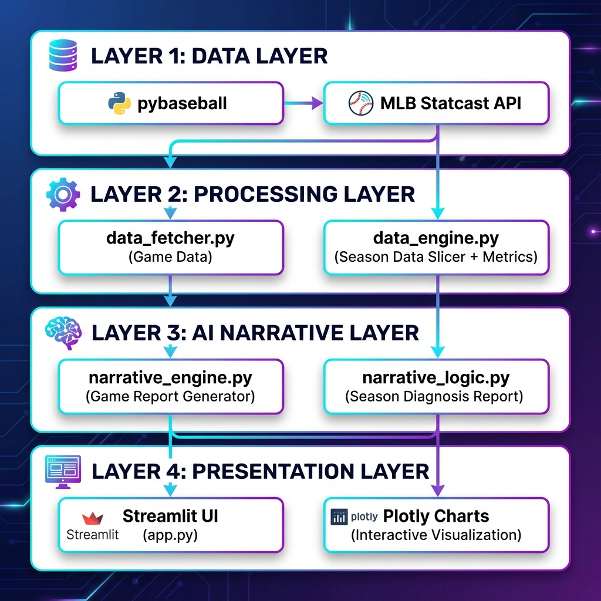

# ⚾ 棒球 AI 統一分析平台

整合 **比賽分析** 與 **季度診斷** 功能的 MLB 棒球 AI 分析系統，結合 MLB Statcast 數據與 Google Gemini AI，提供專業級的中英雙語賽事報導與球員診斷。

---

## 🌟 功能特色

### 📅 比賽分析
- 選擇日期和球隊，自動抓取當日比賽 Play-by-Play 資料
- 基於 **Run Expectancy (RE)** 演算法提取比賽關鍵時刻
- 生成**中英雙語**專業運動記者風格比賽戰報
- 分析特定球員當日對戰策略，結合歷史數據推估投手配球邏輯

### 📊 季度診斷
- 輸入球員姓名，分析整季表現變化
- 將賽季切割為 **Early** (前10場) / **Mid** (季中10場) / **Late** (最後10場) 三階段
- 計算 **10 項關鍵指標**：初速、發射角度、Hard Hit Rate、wOBA、BABIP 等
- 互動式 **Plotly 圖表**視覺化（長條圖、趨勢圖、雷達圖）
- AI 生成**專業球探風格**診斷報告

---

## � 技術架構



---

## 🧠 敘事生成引擎（核心特色）

本專案最大的技術亮點在於 **AI 敘事引擎**，透過精心設計的 Prompt Engineering 生成高品質的棒球分析報告。

### 🎯 比賽戰報生成 (`narrative_engine.py`)

#### 關鍵時刻提取演算法
```python
# 基於 Run Expectancy 變化量 (delta_run_exp) 排序
# 越大的 |delta_run_exp| 代表對比賽勝負影響越大
action_plays['importance'] = action_plays['delta_run_exp'].abs()
top_plays = action_plays.sort_values(by='importance', ascending=False).head(top_n)
```

#### Prompt 設計策略
| 策略 | 說明 |
|------|------|
| **敘事風格指令** | 採用戲劇性語言（Rocketted、Crushed、Blazing）而非枯燥列點 |
| **強制數據整合** | 必須使用 Exit Velocity、Distance、Pitch Speed 等 Statcast 指標 |
| **雙語輸出** | 一次生成 English + 繁體中文，確保翻譯自然且使用正確棒球術語 |
| **結構化 JSON** | 強制 AI 回傳 `{"english": "...", "chinese": "..."}` 格式避免解析錯誤 |

#### 雙語範例輸出
```json
{
  "english": "In the bottom of the 9th, with two outs and the score tied at 3-3, 
              Ohtani crushed a 95.2 mph fastball, sending it 425 feet into the 
              right-field stands at an exit velocity of 112.3 mph...",
  "chinese": "九局下半，二出局比數 3 比 3 平手，大谷翔平狠狠轟出一顆時速 95.2 英哩的
              速球，擊球初速高達 112.3 英哩，飛行距離 425 英尺落入右外野看台..."
}
```

---

### 🎯 球員策略分析 (`generate_player_analysis`)

這是本專案最具巧思的功能：**結合當日比賽數據 + 歷史對戰數據**，讓 AI 推估投手的「配球意圖」。

#### 核心設計理念

```
┌─────────────────────────────────────────────────────────┐
│                    為什麼要這樣設計？                     │
├─────────────────────────────────────────────────────────┤
│  單看「今天投手投了什麼球」只是結果                         │
│  要理解「為什麼這樣投」，需要知道打者的歷史弱點               │
│                                                         │
│  📊 當日數據 (What happened)                             │
│     ↓                                                   │
│  📜 歷史數據 (Why it happened)                           │
│     ↓                                                   │
│  🧠 AI 推論 (Strategic Inference)                        │
└─────────────────────────────────────────────────────────┘
```

#### 數據收集架構

```python
# ===== 當日比賽數據 =====
today_pitch_counts = game_df['pitch_type'].value_counts()  # 今天面對的球種分布
today_zones = game_df['zone'].value_counts()               # 今天被投的進壘位置
today_results = game_df['events'].dropna().tolist()        # 今天的打擊結果

# ===== 最近 15 場歷史數據 =====
history_df = get_player_history(batter_id, game_date)      # 抓取近 15 場資料
hist_pitch_counts = history_df['pitch_type'].value_counts() # 歷史常面對球種
recent_avg = hits / at_bats                                 # 近況打擊率
hist_hr = (hist_events == 'home_run').sum()                # 近期全壘打數
hist_k = (hist_events == 'strikeout').sum()                # 近期被三振數
```

#### Zone 分析巧思

Statcast 將好球帶分為 13 個區域 (Zone 1-13 + 14-19 壞球區)：

```
┌─────────────────┐
│  11    12    13 │  ← 高壞球區
├─────┬─────┬─────┤
│  1  │  2  │  3  │  ← 高 (好球帶上緣)
├─────┼─────┼─────┤
│  4  │  5  │  6  │  ← 中 (腰帶高度)
├─────┼─────┼─────┤
│  7  │  8  │  9  │  ← 低 (膝蓋高度)
├─────┴─────┴─────┤
│  14    15    16 │  ← 低壞球區
└─────────────────┘
```

透過 `zone` 分布分析，AI 可以推論：
- **Zone 1-3 居多** → 投手嘗試高球壓制
- **Zone 7-9 居多** → 投手用低球引誘揮空
- **Zone 14-19 居多** → 投手故意投壞球引誘追打

#### Prompt 設計重點

```python
system_prompt = """
You are an expert MLB analyst. Analyze the pitching strategy used against the specified batter.

Guidelines:
1. **Today's Strategy**: Based on the pitch mix and zones today, describe the approach.
2. **Historical Context**: Reference the batter's recent form (AVG, HR, K) to explain 
   WHY the pitcher might have chosen this strategy.
3. **Inference**: Conclude with a hypothesis on the pitcher's intent.
"""
```

#### 輸出範例

```json
{
  "english": "Today, pitchers primarily attacked Ohtani with breaking balls (52% sliders, 
              28% curveballs), targeting zones 7-9 (low strike zone). This is consistent 
              with Ohtani's recent struggles - he has struck out 8 times in the last 15 
              games with a .267 average, suggesting pitchers are exploiting his tendency 
              to chase low breaking balls...",
  
  "chinese": "今天投手主要用變化球攻擊大谷翔平（52% 滑球、28% 曲球），瞄準 7-9 區的低位
              好球帶。這與大谷近期狀況吻合——過去 15 場他被三振 8 次，打擊率僅 .267，
              顯示投手正在利用他追打低位變化球的習慣..."
}
```

#### 這個功能的價值

| 傳統分析 | 本系統分析 |
|----------|------------|
| 「今天投手投了很多滑球」 | 「投手投滑球是因為打者近 15 場追打滑球的機率偏高」 |
| 「打者今天被三振 2 次」 | 「兩次三振都發生在低位變化球，符合歷史弱點」 |
| 只看結果 (What) | 推論意圖 (Why) + 預測 (What's next) |

---

### 📈 季度診斷報告 (`narrative_logic.py`)

#### 球探風格 Prompt
本專案採用**「跟不懂棒球的朋友解釋」**的寫作策略，讓報告既專業又易懂：

```python
SCOUT_SYSTEM_PROMPT = """你是棒球解說員，正在向「完全不懂棒球的朋友」解釋一位球員的表現。

【術語解釋方式】
- 「他的擊球速度平均 95 mph，比聯盟平均的 88 mph 快了不少，這代表他打出去的球又快又扎實」
- 「wOBA 0.420，聯盟平均大概 0.320，等於他每次上場打擊能創造的價值比一般球員高出 30% 左右」

【寫作規則】
1. 數據要跟聯盟平均比較，讓讀者知道「好在哪、差在哪」
2. 不要用籠統的說法（如「打擊很好」），要具體說「因為 XX 數據比平均高多少」
3. 語氣輕鬆，像跟朋友聊天
"""
```

#### 生成報告結構
1. **一句話總結**：直接說結論
2. **進步/退步分析**：Early → Mid → Late 的數據變化
3. **打擊風格定位**：大砲型 vs 技巧型
4. **最重要的發現**：濃縮成一個記憶點

---

## 📋 數據處理流程

### 季度切片邏輯 (`data_engine.py`)

```
全賽季 Statcast 資料
        │
        ▼
┌───────────────────────────┐
│  依 game_date 排序並編號  │
│  計算每場比賽的 game_index │
└───────────────────────────┘
        │
        ▼
┌────────┬────────┬────────┐
│ Early  │  Mid   │  Late  │
│ 前10場 │ 中間10場│ 後10場 │
└────────┴────────┴────────┘
        │
        ▼
┌───────────────────────────┐
│   每段計算 10 項指標：     │
│   avg_launch_speed        │
│   avg_launch_angle        │
│   hard_hit_rate           │
│   barrel_rate             │
│   k_rate                  │
│   bb_rate                 │
│   woba                    │
│   babip                   │
│   home_runs               │
│   total_plate_appearances │
└───────────────────────────┘
        │
        ▼
    建立趨勢分析 JSON
```

---

## �🚀 快速開始

### 1. 安裝套件

```bash
cd baseball_ai_unified
pip install -r requirements.txt
```

### 2. 設定 API Key

複製 `.env.example` 為 `.env`，填入您的 Gemini API Key：

```bash
cp .env.example .env
```

編輯 `.env`：
```
OPENAI_API_KEY=your_actual_gemini_api_key_here
```

### 3. 執行應用程式

```bash
streamlit run app.py
```

---

## 📁 專案結構

```
baseball_ai_unified/
├── app.py                    # 主程式 (Streamlit) - 含玻璃態 CSS 美化設計
├── requirements.txt          # 套件依賴
├── .env.example              # API Key 範例
├── README.md                 # 本文件
└── src/
    ├── __init__.py
    ├── data_fetcher.py       # 比賽 Play-by-Play 資料抓取
    ├── data_engine.py        # 季度分析引擎 (切片 + 指標聚合)
    ├── narrative_engine.py   # 比賽敘事生成 (雙語戰報 + 對戰策略)
    └── narrative_logic.py    # 季度診斷報告 (球探風格 AI)
```

---

## 📚 技術堆疊

| 層級 | 技術 | 用途 |
|------|------|------|
| **資料來源** | pybaseball | 抓取 MLB Statcast 逐球資料 |
| **AI 引擎** | Google Gemini 2.5 Flash | 生成自然語言報告 |
| **介面框架** | Streamlit | 互動式 Web UI |
| **圖表視覺化** | Plotly | 長條圖、趨勢圖、雷達圖 |
| **資料處理** | Pandas, NumPy | 數據清理與聚合運算 |
| **環境管理** | python-dotenv | API Key 安全管理 |

---

## 📋 使用說明

### 比賽分析

1. 切換到「📅 比賽分析」標籤頁
2. 選擇比賽日期和球隊
3. 點擊「生成比賽戰報」
4. 查看中英雙語戰報
5. 選擇打者進行策略分析

### 季度診斷

1. 切換到「📊 季度診斷」標籤頁
2. 輸入球員英文姓名 (例如: Ohtani, Shohei)
3. 選擇賽季
4. 點擊「開始分析」
5. 查看圖表和快速摘要
6. 點擊「生成 AI 報告」取得完整診斷

---

## ⚠️ 注意事項

1. **網路需求**: 需連線抓取 MLB Statcast 資料
2. **樣本限制**: 季度診斷需球員至少出賽 30 場
3. **API Key 安全**: `.env` 檔案請勿上傳至 Git

---

## 🎨 UI 設計

本專案採用現代化玻璃態 (Glassmorphism) 設計風格：
- 漸層紫藍色背景
- 模糊玻璃效果容器
- 自適應深色/淺色輸入框
- Google Noto Sans TC 中文字體

---

## 授權

本專案僅供學術研究使用。MLB 資料版權歸 Major League Baseball 所有。
